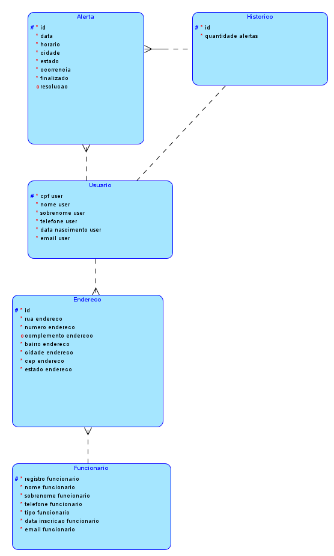
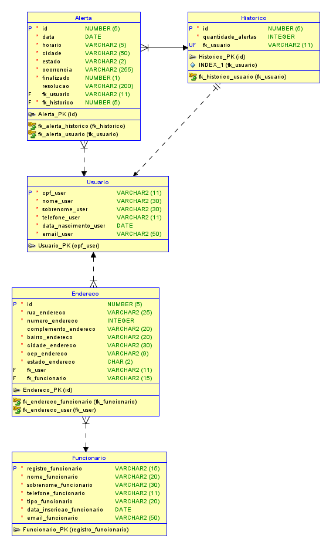

# 🧠 Global Solution: Java Advanced — N.I.M.

O projeto **N.I.M.** visa desenvolver um aplicativo para os usuários possam cadastrar **Alertas** de eventos extremos que estejam presenciando. Desta maneira, sempre que o aplicativo for acessado, um usuário poderá saber se há ou não algo ocorrendo na sua região, impedindo assim que haja um número maior de vítimas e afetados.

---

## 🧪 Dados Iniciais Gerados (DataInitializer)

### 👤 Usuário

| Campo | Valor |
|-------|-------|
| Nome | Teste inicial |
| Sobrenome | Spring |
| CPF | 599.972.590-92 |
| Telefone | 1234567890 |
| E-mail | mariateste.fogolin@example.com |
| Data de nascimento | 01/01/1990 |

> Histórico do usuário é criado automaticamente com 1 alerta.

---

### ⚠️ Alerta

| Campo | Valor |
|-------|-------|
| Evento | Teste de Alerta |
| Gravidade | 3 (moderada) |
| Localização | -23.5505, -46.6333 |
| Data/Hora | gerados em tempo de execução |

---

### 👷 Funcionário

| Campo | Valor |
|-------|-------|
| Nome | João |
| Sobrenome | Silva |
| Registro | 12345678 |
| Tipo | Técnico |
| Telefone | 11 99999-9999 |
| E-mail | joao.silva@example.com |
| Data de inscrição | Data da execução |
| Endereço | Rua Exemplo, Centro, São Paulo - SP, 01001-000 |

---

## 🛡️ Acesso Inicial (Spring Security)

| Usuário | Senha |
|--------|-------|
| admin  | admin123 |

---
## API Endpoints

### AIController

| Método | Endpoint             | Descrição                          | Requisição                          | Resposta                   |
|--------|----------------------|----------------------------------|-----------------------------------|----------------------------|
| POST   | `/deepseek-r1-query` | Envia uma query para o modelo AI | JSON: `{ "query": "sua pergunta" }` | Texto com resposta do modelo AI |

---

### AlertaController

| Método | Endpoint               | Descrição                              | Requisição                        | Resposta                        |
|--------|------------------------|--------------------------------------|---------------------------------|--------------------------------|
| GET    | `/alertas`             | Lista todos os alertas                | -                               | Página HTML com lista de alertas |
| GET    | `/alertas/novo/{cpf}`  | Formulário para criar novo alerta para usuário pelo CPF | - | Página HTML com formulário de alerta |
| POST   | `/alertas/novo/{cpf}`  | Salva novo alerta para usuário pelo CPF | Formulário preenchido do alerta | Redireciona para lista de alertas |
| GET    | `/alertas/{id}`        | Exibe os detalhes de um alerta pelo ID | -                               | Página HTML com detalhes do alerta |
| GET    | `/alertas/editar/{id}` | Formulário para editar alerta pelo ID | -                               | Página HTML com formulário de edição |
| POST   | `/alertas/editar`      | Atualiza o alerta                    | Formulário preenchido do alerta | Redireciona para lista de alertas |
| GET    | `/alertas/deletar/{id}`| Deleta alerta pelo ID                | -                               | Redireciona para lista de alertas |

---

### FuncionarioController

| Método | Endpoint                      | Descrição                              | Requisição                       | Resposta                        |
|--------|-------------------------------|--------------------------------------|---------------------------------|--------------------------------|
| GET    | `/funcionarios`               | Lista todos os funcionários           | -                               | Página HTML com lista de funcionários |
| GET    | `/funcionarios/novo`          | Formulário para cadastrar funcionário | -                               | Página HTML com formulário      |
| POST   | `/funcionarios/novo`          | Salva novo funcionário                | Formulário preenchido do funcionário | Redireciona para lista de funcionários |
| GET    | `/funcionarios/{registroFuncionario}` | Exibe detalhes do funcionário pelo registro | -                         | Página HTML com detalhes        |
| GET    | `/funcionarios/editar/{registroFuncionario}` | Formulário para editar funcionário | -                         | Página HTML com formulário de edição |
| POST   | `/funcionarios/editar`        | Atualiza funcionário                  | Formulário preenchido do funcionário | Redireciona para lista de funcionários |
| GET    | `/funcionarios/deletar/{registroFuncionario}` | Deleta funcionário pelo registro   | -                               | Redireciona para lista de funcionários |

---

### HistoricoController

| Método | Endpoint               | Descrição                              | Requisição                     | Resposta                          |
|--------|------------------------|--------------------------------------|-------------------------------|----------------------------------|
| GET    | `/historicos`          | Lista todos os históricos             | -                             | Página HTML com lista de históricos |
| GET    | `/historicos/{id}`     | Visualiza um histórico pelo ID        | -                             | Página HTML com detalhes do histórico |
| GET    | `/historicos/deletar/{id}` | Deleta histórico pelo ID           | -                             | Redireciona para lista de históricos |

---

### LoginController

| Método | Endpoint    | Descrição                            | Requisição                         | Resposta                  |
|--------|-------------|------------------------------------|----------------------------------|---------------------------|
| GET    | `/login`    | Página de login com possível erro ou mensagem de logout | Parâmetros opcionais `error` e `logout` | Página HTML de login |

---

### UsuarioController

| Método | Endpoint              | Descrição                              | Requisição                       | Resposta                        |
|--------|-----------------------|--------------------------------------|---------------------------------|--------------------------------|
| GET    | `/usuarios`           | Lista todos os usuários               | -                               | Página HTML com lista de usuários |
| GET    | `/usuarios/novo`      | Formulário para cadastrar usuário    | -                               | Página HTML com formulário      |
| POST   | `/usuarios/novo`      | Salva novo usuário                    | Formulário preenchido do usuário | Redireciona para lista de usuários |
| GET    | `/usuarios/{cpf}`     | Exibe detalhes do usuário pelo CPF   | -                               | Página HTML com detalhes        |
| GET    | `/usuarios/editar/{cpf}` | Formulário para editar usuário     | -                               | Página HTML com formulário de edição |
| POST   | `/usuarios/editar`    | Atualiza usuário                     | Formulário preenchido do usuário | Redireciona para lista de usuários |
| GET    | `/usuarios/deletar/{cpf}` | Deleta usuário pelo CPF             | -                               | Redireciona para lista de usuários |

---

### Observações

- Endpoints que retornam páginas HTML devem ser acessados via navegador.
- Os formulários de criação e edição enviam dados via POST.
- Atualização de `Funcionario` e `Usuario` também envia mensagens JSON para RabbitMQ para processamento assíncrono.

---

## ⚙️ Tecnologias Utilizadas

- **Backend:** Java + Spring Boot
- **Banco de Dados:** Oracle
- **IA/Data Science:** Python (Machine Learning)
- **Aplicativo Móvel:** Kotlin
- **Observabilidade:** Prometheus e Spring Boot Admin

---

## 🔌 Execução com Docker

```bash
docker-compose up --build
docker exec -it ollama ollama pull deepseek-coder
```

### 📈 Ver métricas

Acesse [http://localhost:9090/targets](http://localhost:9090/targets) para verificar os targets do Prometheus.

---

## 🏗️ Modelagem do Banco

### Modelo Lógico  


### Modelo Físico  


---

## 🎥 Demonstração

📹 [Assista no YouTube](https://youtu.be/Ru4kCOUQZBg)

---

## 🤝 Integrantes

- Igor Gabriel Pereira Marcondes — **RM 553544**
- Maria Beatriz Reis Fogolin de Godoy — **RM 552669**
- Nicholas Pereira Paulo Lima Barbosa — **RM 552744**
